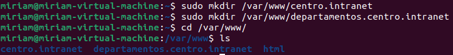
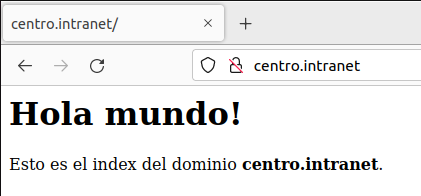
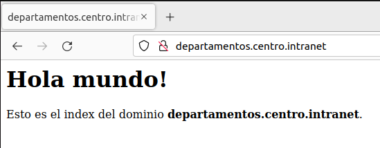

- Lo primero que debemos hacer es instalar apache2, en la consola escribimos:

```bash
sudo apt install apache2
```

- Nos movemos a la carpeta /var/www/ y creamos centro.intranet y departamentos.centro.intranet



- Asignamos la propiedad del directorio con la variable de entorno $USER, que hará referencia a su usuario de sistema actual:

```bash
sudo chown -R $USER:$USER /var/www/centro.intranet
sudo chown -R $USER:$USER /var/www/departamentos.centro.intranet
```
- Configuramos el VirtualHost de los dominios para indicarle a apache que proporción usar como directorio raíz web:

```bash
sudo nano /etc/apache2/sites-available/centros.intranet.conf
```
```apache
<VirtualHost *:80>
    ServerName centros.intranet
    ServerAlias www.centro.intranet
    ServerAdmin webmaster@localhost
    DocumentRoot /var/www/centro.intranet
    ErrorLog ${APACHE_LOG_DIR}/error.log
    CustomLog ${APACHE_LOG_DIR}/access.log combined
</VirtualHost> 
```
```bash
sudo nano /etc/apache2/sites-available/departamentos.centros.intranet.conf
```
```apache
<VirtualHost *:80>
    ServerName departamentos.centro.intranet
    ServerAlias www.departamentos.centro.intranet
    ServerAdmin webmaster@localhost
    DocumentRoot /var/www/departamentos.centro.intranet
    ErrorLog ${APACHE_LOG_DIR}/error.log
    CustomLog ${APACHE_LOG_DIR}/access.log combined
</VirtualHost> 
```

- Habilitamos el nuevo host virtual:

```bash
sudo a2ensite centro.intranet
sudo a2ensite departamentos.centro.intranet
```

- Recargamos:

```bash
systemctl reload apache2
```

- Deshabilitar el sitio web predeterminado de Apache, escribiendo lo siguiente:

```bash
sudo a2dissite 000-default
```

- Para asegurarse de que su archivo de configuración no contenga errores de sintaxis, ejecutamos lo siguiente:

```bash
sudo apache2ctl configtest
```

- Creamos un archivo index.html en la siguiente ubicación para poder probar que el host virtual funciona según lo previsto:

```bash
nano /var/www/centro.intranet/index.html
```

```html
<h1>Hola mundo!</h1>

<p>Esto es el index del dominio  <strong>centro.intranet</strong>.</p>
```

- Repetimos lo mismo para el otro dominio:

```bash
nano /var/www/departamentos.centro.intranet/index.html
```

```html
<h1>Hola mundo!</h1>

<p>Esto es el index del dominio  <strong>departamentos.centro.intranet</strong>.</p>
```

- Comprobamos que podemos entrar en los dominios desde el navegador:


------------------------------

